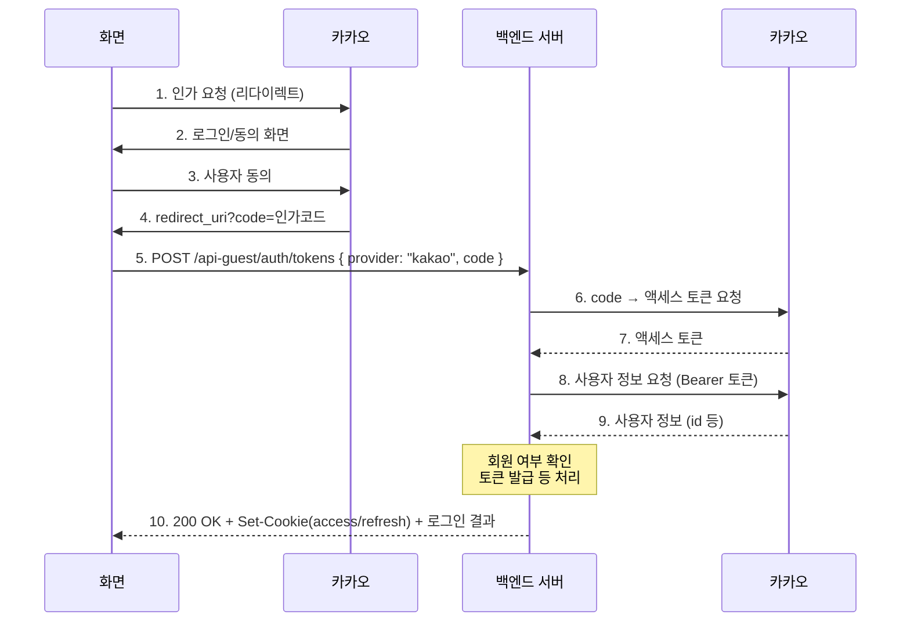
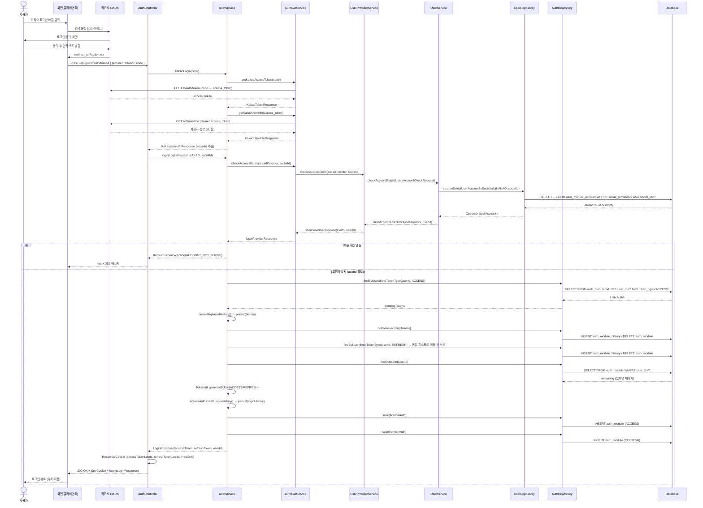
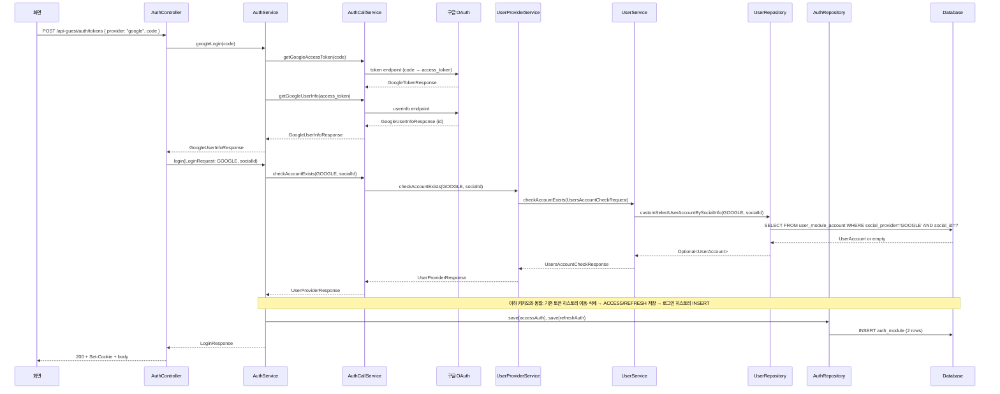

# 로그인 방식 시퀀스 다이어그램

현재 프로젝트(Leeds Profile Spring Boot Core)의 **소셜 로그인(카카오/구글)** 흐름을 화면·백엔드·DB 관점으로 정리한 시퀀스 다이어그램입니다.

---

## 카카오 로그인 (화면 · 카카오 · 백엔드 서버 · 카카오)

---

## 1. 카카오 로그인 (전체 흐름, 상세)

---

## 2. 구글 로그인 (백엔드·DB만, 화면은 동일 패턴)

---

## 3. DB 테이블 관점 요약

| 구간 | 테이블 | 동작 |
|------|--------|------|
| 회원 여부 확인 | `user_module_account` | SELECT (social_provider, social_id) |
| 기존 토큰 정리 | `auth_module` | SELECT → (해당 토큰) DELETE |
| 히스토리 보관 | `auth_module_history` | INSERT (로그인/교체/로그아웃 등 이벤트) |
| 새 토큰 발급 | `auth_module` | INSERT (ACCESS 1건, REFRESH 1건) |

---

## 4. 참고: 로그인 전제 조건

- **카카오/구글 로그인 API**: 이미 **회원가입**이 되어 있어야 함.
- 회원가입: `POST /api-guest/users/accounts` (body: `provider`, `code`, `phone`)으로 `user_module` + `user_module_account`에 계정 생성 후, 동일한 소셜 정보로 로그인 시 `checkAccountExists`가 true가 되어 토큰이 발급됩니다.
- 회원가입이 안 된 소셜 ID로 로그인하면 `ACCOUNT_NOT_FOUND` 예외로 실패합니다.

---

## 5. 파일 위치 참고

| 역할 | 클래스/파일 |
|------|-------------|
| 화면 연동 API | `AuthController` – `POST /api-guest/auth/tokens` (body: `provider`, `code`) |
| 로그인 오케스트레이션 | `AuthService` – `kakaoLogin()`, `googleLogin()`, `login()` |
| 외부/유저 모듈 호출 | `AuthCallService` – 카카오/구글 API, `UserProviderService.checkAccountExists()` |
| 계정 존재 여부 | `UserProviderService` → `UserService.checkAccountExists()` → `UserRepository.customSelectUserAccountBySocialInfo()` |
| 토큰 저장/조회/삭제 | `AuthRepository` – `auth_module`, `auth_module_history` |
| 계정 조회 | `UserRepository` – `user_module_account` (customSelectUserAccountBySocialInfo) |

---

## 6. REST API 경로 (엄격한 REST 적용)

URL은 명사(리소스), 동작은 HTTP 메서드로 표현합니다.

| 용도 | 메서드·경로 | Request body |
|------|-------------|--------------|
| 소셜 로그인 (토큰 발급) | `POST /api-guest/auth/tokens` | `{ "provider": "kakao" \| "google", "code": "인가코드" }` |
| 소셜 회원가입 (계정 생성) | `POST /api-guest/users/accounts` | `{ "provider": "kakao" \| "google", "code": "인가코드", "phone": "전화번호" }` |
| SMS 인증번호 발송 | `POST /api/sms/verification-codes` | `{ "toPhoneNumber": "+82..." }` |
| SMS 인증번호 검증 | `POST /api/sms/verification-codes/validate` | `{ "toPhoneNumber": "+82...", "verificationCode": "123456" }` |
